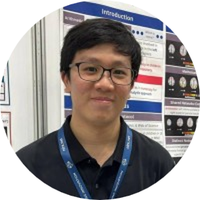

### **Lab director**

::::: columns
::: {.column width="20%"}
{width="150"}
:::

::: {.column width="80%"}
#### Yu Junhong— Assistant Professor of Psychology

PhD, The University of Hong Kong\
Research interests: My research makes use of multimodal neuroimaging to study neuropsychology and cognitive aging in general. In particular, I am interested neurocognitive disorders, superior cognitive aging, neural predictors of cognitive decline and cognitive enhancement interventions
:::
:::::

------------------------------------------------------------------------

### **Research Staff**

::::: columns
::: {.column width="20%"}
{width="150"}
:::

::: {.column width="80%"}
#### Charly Billaud — Research Fellow

PhD (Neurosciences), Aston University, Birmingham, United Kingdom\
Research interests: Translational research involving neuropsychology and neuroimaging, including structural/functional MRI, DTI, and MEG. I have a particular interest in both aging and paediatric clinical populations with neurological disorders and developing markers of cognition and behaviour. My work involves structural and functional network analyses and graph theory.
:::
:::::

::::: columns
::: {.column width="20%"}
{width="150"}
:::

::: {.column width="80%"}
#### Dexter Chew — Research Assistant

BA (Psychology), University at Buffalo\
Research interests: My research interests are in topics such as Mental Health of Elderly Patients, Elder Abuse with Long-Lasting Psychological consequences as well as Psychosocial Development of Criminals. I became interested in the mental health aspects of the elderly stemming from 2 years of working in the non-profit sector as well as being an active member of the grassroots level in Singapore. This has helped establish the different views and interests in the elderly being overlooked or becoming a marginalized group of individuals in society. Further interests in criminal psychosocial developments stemmed from an interest in reading serial killer bibliographies and documentaries that have led to a fascination of how the minds of hardened criminals are like.
:::
:::::

------------------------------------------------------------------------

### **Graduate students**

::::: columns
::: {.column width="20%"}
{width="150"}
:::

::: {.column width="80%"}
#### Savannah Siew — PhD student

B.Soc.Sci (Psychology), National University of Singapore\
Research interests: Neuropsychology, mindfulness, clinical psychology
:::
:::::

::::: columns
::: {.column width="20%"}
{width="150"}
:::

::: {.column width="80%"}
#### Janice Koi — PhD student

B.A. Hons (Psychology), Nanyang Technological University\
Research Interests: I am interested in using multimodal neuroimaging techniques to study the neurocognitive mechanisms of healthy aging.
:::
:::::

::::: columns
::: {.column width="20%"}
{width="150"}
:::

::: {.column width="80%"}
#### See Qi Rui — PhD student

B.Sc. (Hons) in Biological Sciences, Nanyang Technological University\
Research Interests: I am interested in investigating the neurocognitive role of sleep and mental health in healthy aging and neurodegenerative disorders.
:::
:::::

------------------------------------------------------------------------

### **Undergraduate students**

::::: columns
::: {.column width="20%"}
{width="150"}
:::

::: {.column width="80%"}
#### Xavier Lim — FYP/URECA student

Research Interests: My research interests lie in the intersection of translational clinical neuroscience and MRI methods. Specifically, I apply network analyses and normative modelling to investigate brain-based predictors of psychiatric disorders such as depression and anxiety. In another line of research, I am also interested in how arts-based interventions can improve the living experiences of people living with dementia.
:::
:::::

::::: columns
::: {.column width="20%"}
{width="150"}
:::

::: {.column width="80%"}
#### Yong Jia Hui — FYP student

Research Interests: I am interested in understanding the mechanisms that underlie neurodegenerative diseases, and the brain differences between healthy individuals and patients with neurological or psychiatric conditions. On top of that, I am passionate about researching lifestyle factors (eg. dietary habits, sleep) and developing interventions that can improve brain health.
:::
:::::

::::: columns
::: {.column width="20%"}
{width="150"}
:::

::: {.column width="80%"}
#### Sarah Aleisha — FYP student

Research Interests: I'm interested in understanding how social factors shape developmental outcomes in behaviour and cognition, and in applying neuroscience methods in understanding these effects across the lifespan. I am also interested in understanding how neurodevelopmental disorders, such as ADHD, may influence cognitive outcomes in adulthood and later life.
:::
:::::

::::: columns
::: {.column width="20%"}
{width="150"}
:::

::: {.column width="80%"}
#### Shona Chong — FYP student

Research Interests: My interests lie in neuropsychology, with a focus on understanding the factors that contribute to the development and progression of cognitive and neurodegenerative disorders through the use of neuroimaging techniques.
:::
:::::

::::: columns
::: {.column width="20%"}
{width="150"}
:::

::: {.column width="80%"}
#### Nicolette Marie Monterio — URECA student

Research Interests: I would be keen to generally explore the topic of youths diagnosed with anxiety.
:::
:::::

::::: columns
::: {.column width="20%"}
{width="150"}
:::

::: {.column width="80%"}
#### Sherrer See — URECA student

Research Interests: I am interested in the study of substance use disorders, how substance use of psychoactive drugs affects brain structure, function and cognitive trajectories. I am also interested in the mechanisms behind how substance use could affect neurodegenerative processes, and how neuroimaging could be utilized to better provide rehabilitative services.
:::
:::::

::::: columns
::: {.column width="20%"}
{width="150"}
:::

::: {.column width="80%"}
#### Rachel Ng — URECA student

Research Interests: My interest lies in the neuropsychology of disadvantaged communities – specifically how past experiences and socio-economic factors shape cognitive function and behavior. By gaining a more nuanced perspective of the impacts of inequality in both Singapore and the world. I hope to contribute to practical interventions to uplift these individuals and communities.
:::
:::::

------------------------------------------------------------------------

### **Previous Students**

#### **FYP**

-   Candace Tan (2024-2025)
-   Ellsie Lee (2024-2025)
-   Lee Zheng Long (2024-2025) — **Admitted to PhD \@ Max Planck School of Cognition**
-   Kayla Tan (2024-2025)
-   Lisa Wong (2023-2024)
-   Tan Fu Miao (2023-2024) — **Admitted to MPhil \@ Cambridge \| Lee Kuan Yew Gold Medal, and Best Datablitz Presentation at AS4SAN 2024 conference**
-   Angel Lee (2023-2024)
-   Genevieve Ling (2022-2023)
-   Cleon Chang (2022-2023)
-   Yuvaraj Arumugam (2022-2023)
-   Loh Raye Fion (2021-2022)

#### **URECA**

-   Lucius Hong (2024-2025)
-   Nicolas Lok (2024-2025)
-   Emilienne Ho (2024-2025)
-   Bryan Yeo (2024-2025)
-   Kng Jia Hao (2023-2024) — **Admitted to MSc**
-   Wang Jieqi (2023-2024)
-   Alastair Khoo (2023-2024)
-   Xavier Lim (2023-2024)
-   Lee Zheng Long (2022-2023)
-   Gisele Cheong (2022-2023)
-   Celine Chan (2021-2022)
-   Dan Yuet Ruh (2021-2022) — **Admitted to MD \@ Duke-NUS**
